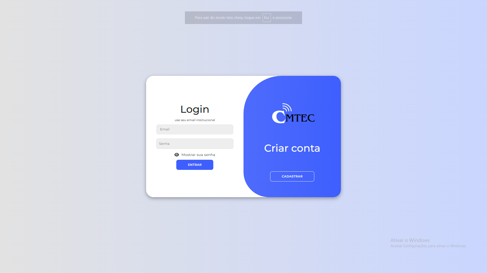
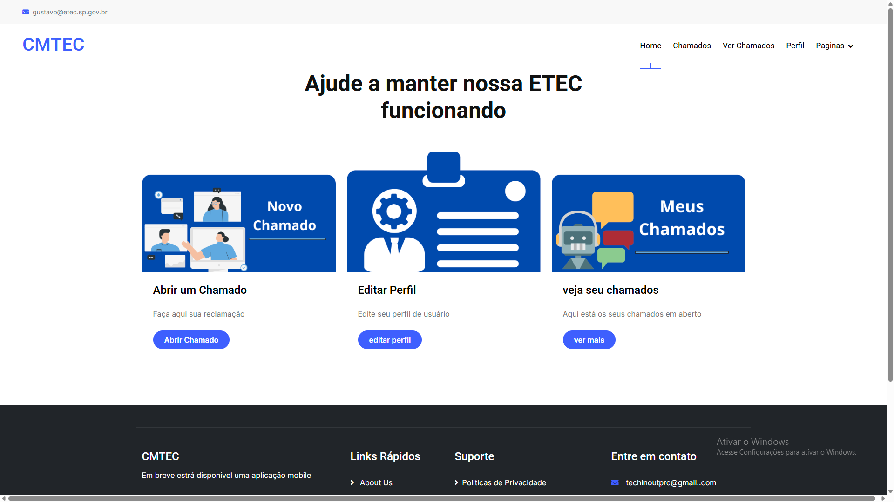
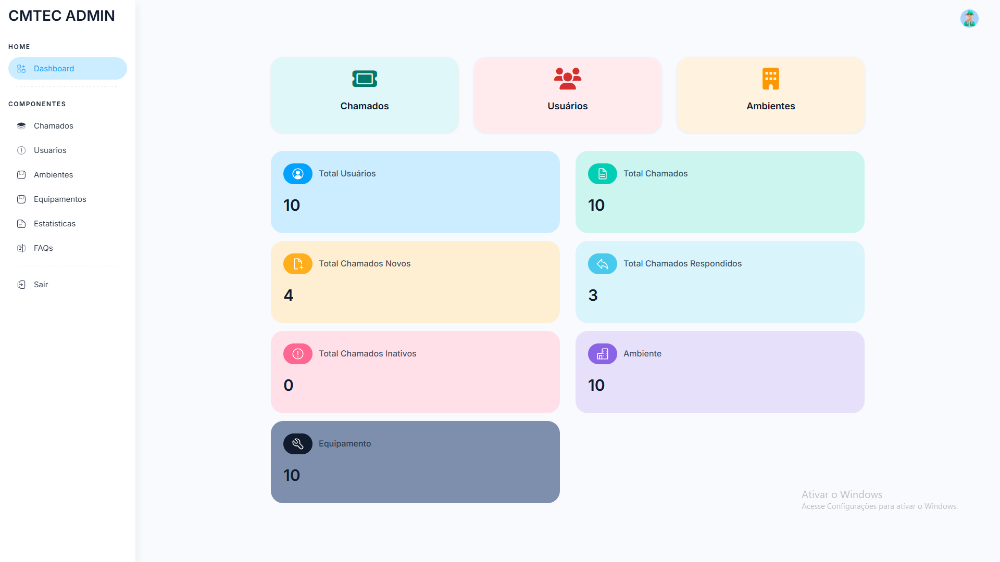
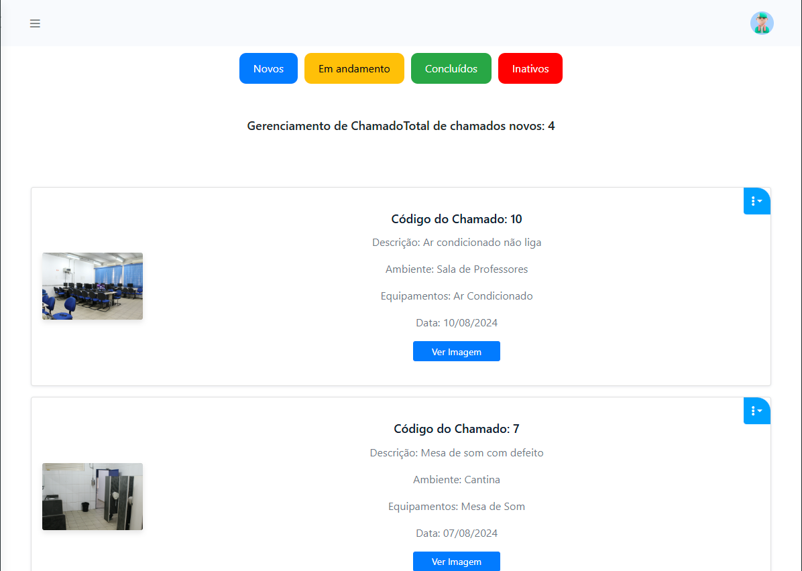

# 🎓 Final Project - School Incident Management System  

This is my final course project, a system designed to receive and manage incident reports at my school. Students can report issues, and school staff are responsible for resolving them efficiently.  

## 🚀 Technologies Used  

- PHP (with PDO for database connection)  
- MySQL (database)  
- HTML, CSS, and JavaScript  
- XAMPP (for local server)  # 🎓 Final Project - School Incident Management System
## 🛠️ How to Run the Project  

1. Install [XAMPP](https://www.apachefriends.org/download.html).  
2. Start the **Apache** and **MySQL** servers in XAMPP.  
3. Import the database into MySQL using **phpMyAdmin**.  
4. Move the project folder to `htdocs` (inside the XAMPP installation directory).  
5. Open your browser and access:  
http://localhost/CMTEC/

## 🔑 Admin Access  

To log in as an **admin**, use the following credentials:  
- **Email:** `admin`  
- **Password:** `1234`  

## 👤 Creating a User Account  

To create an account, you must use an **email address ending in** `@etec.sp.gov.br`.  

<<<<<<< HEAD
=======
## 👤 User Screenshots

  
*Login and Registration Screen*

  
*Home Screen*

## 🛠️ Admin Screenshots

  
*Admin Home Screen*

  
*Incident Management Screen*

>>>>>>> 67d31d6 (screenshot commit)
## 🏆 Future Improvements  

- 🔹 Implement a notification system  
- 🔹 Improve the user interface  
- 🔹 Add an issue tracking dashboard  

---

<<<<<<< HEAD
If you have any questions or suggestions, feel free to contribute! 🚀  

